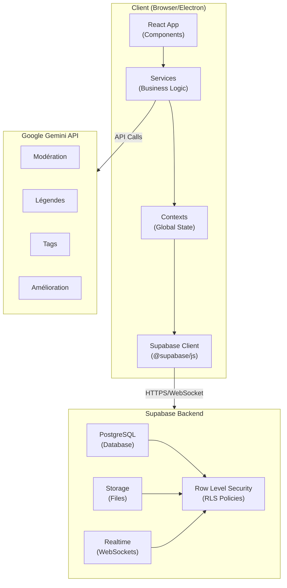
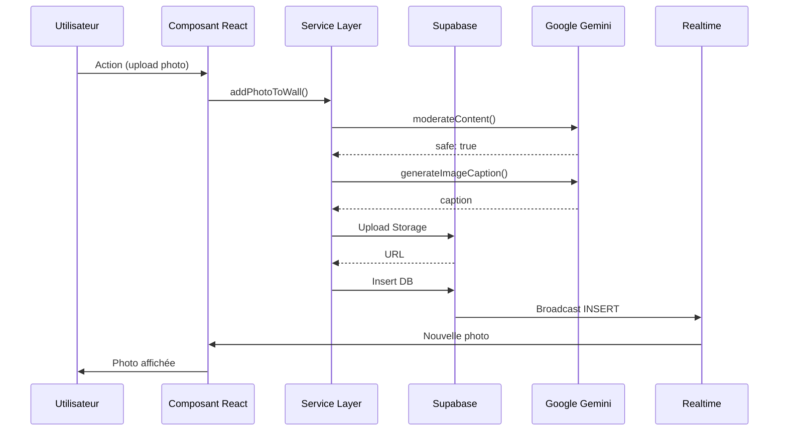
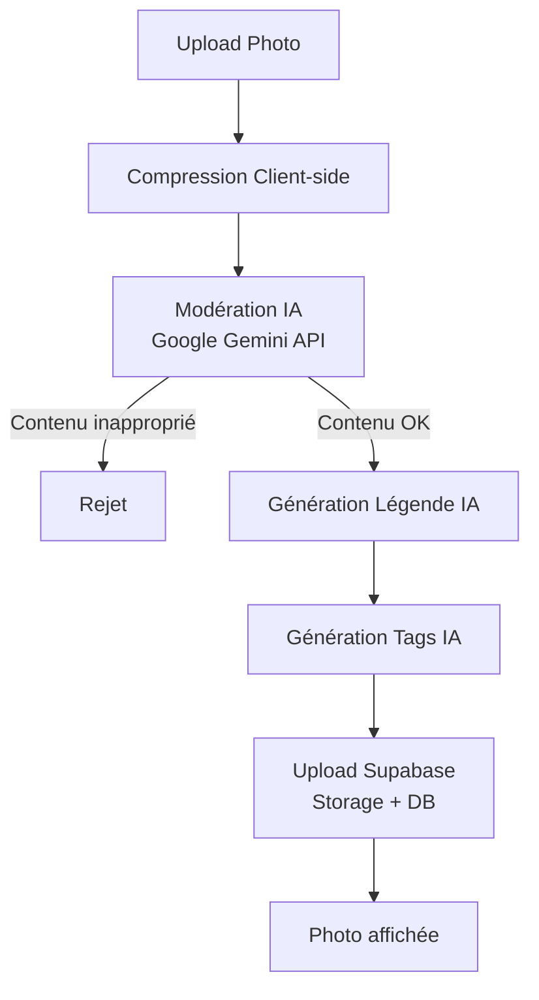
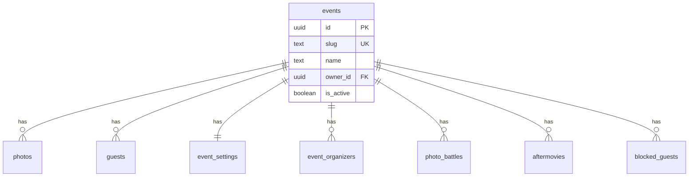
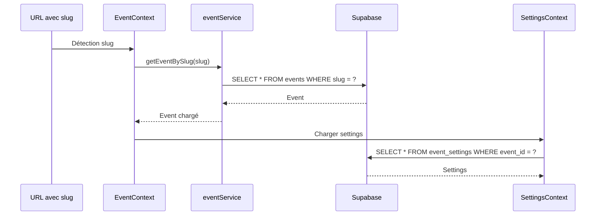
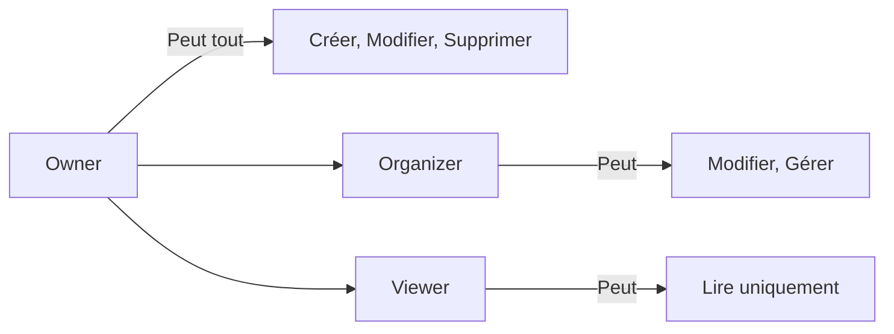
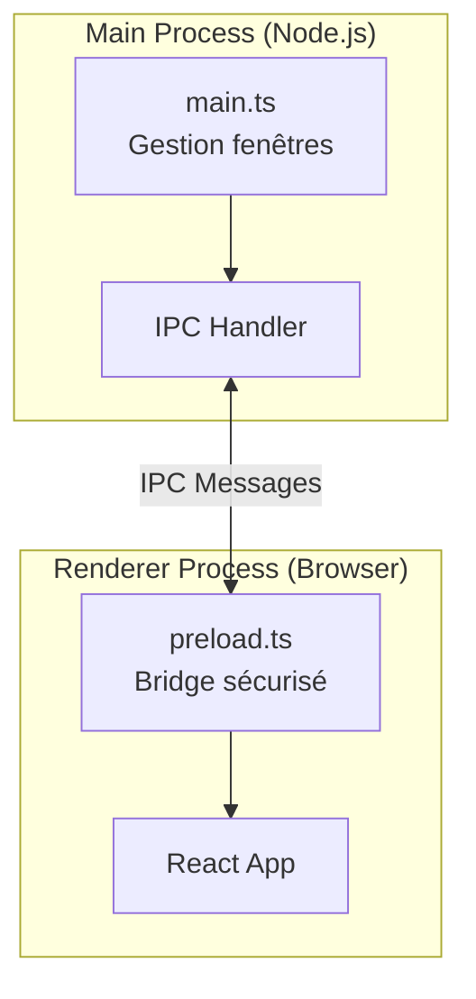
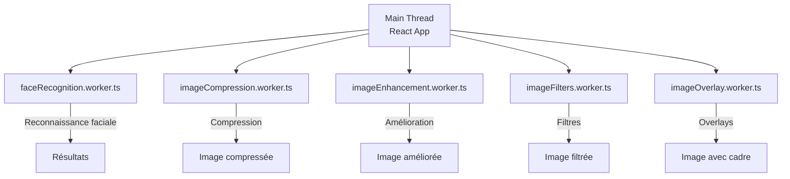
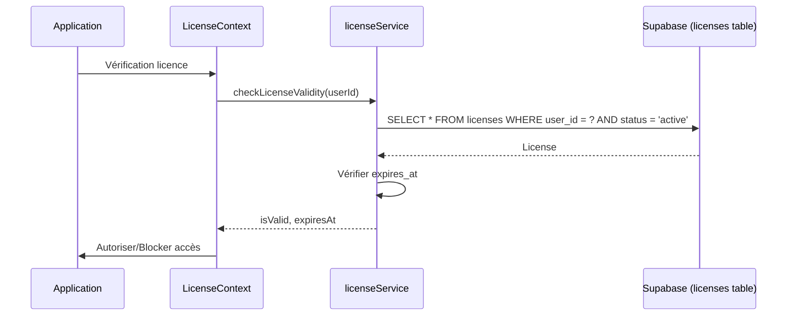

# 🏗️ Architecture de Partywall

Ce document décrit l'architecture complète de l'application Partywall, une plateforme SaaS de mur photo interactif en temps réel.

---

## 📐 Vue d'ensemble

Partywall est une application **SPA (Single Page Application)** React avec un backend **Supabase** (PostgreSQL + Storage + Realtime + Auth). L'application utilise **Google Gemini** pour l'IA et peut être déployée en **web** ou en **desktop** (Electron).

### Stack technique

```
Frontend: React 19.2 + TypeScript 5.8 + Vite 6.2 + Tailwind CSS 4.1
Backend: Supabase (PostgreSQL + Storage + Realtime + Auth)
IA: Google Gemini 3 Flash / Gemini 2.5 Flash
Desktop: Electron 39.2
```

---

## 🎯 Architecture générale



### Flux de données principal



---

## 🎨 Architecture Frontend

### Structure des dossiers

```
components/          # Composants React organisés par fonctionnalité
├── landing/        # Landing page SaaS
├── gallery/        # Galerie interactive avec filtres
├── projection/     # Mode projection grand écran
├── wall/           # Mur interactif
├── stats/          # Analytics et statistiques
├── admin/          # Dashboard administrateur
├── photobooth/     # Photobooth avec caméra
├── rgpd/           # Composants RGPD (consentement, politique)
└── ...

services/           # Logique métier isolée (Service Layer Pattern)
├── supabaseClient.ts      # Configuration Supabase
├── photoService.ts         # CRUD photos, likes, réactions
├── eventService.ts         # Gestion événements (multi-tenant)
├── guestService.ts         # Gestion invités
├── geminiService.ts        # Intégration IA (légendes, modération)
├── aftermovieService.ts    # Génération timelapse
├── battleService.ts        # Battles photos
├── settingsService.ts      # Paramètres d'événement
├── gamificationService.ts  # Badges, points, classements
└── ...

context/            # État global React Context
├── AuthContext.tsx         # Authentification
├── EventContext.tsx        # Multi-tenant (événement actif)
├── PhotosContext.tsx       # Photos avec Realtime
├── SettingsContext.tsx    # Paramètres d'événement
└── ToastContext.tsx        # Notifications toast

hooks/               # Hooks personnalisés React
├── useCamera.ts            # Gestion caméra
├── useImageCompression.ts  # Compression images
├── useDebounce.ts          # Debounce pour optimisations
└── ...

utils/               # Utilitaires
├── validation.ts           # Validation de données
├── imageFilters.ts         # Filtres d'image
├── imageOverlay.ts         # Overlays/cadres
├── logger.ts               # Logging structuré
└── ...

types.ts             # Types TypeScript partagés
constants.ts         # Constantes globales
```

### Patterns architecturaux

#### 1. Service Layer Pattern

Toute la logique métier est isolée dans `/services`. Les composants restent "stupides" et délèguent aux services.

**Exemple** :
```typescript
// ❌ Mauvais : logique dans le composant
const MyComponent = () => {
  const handleUpload = async (file: File) => {
    const formData = new FormData();
    formData.append('file', file);
    const response = await fetch('/api/upload', { method: 'POST', body: formData });
    // ...
  };
};

// ✅ Bon : logique dans le service
import { addPhotoToWall } from '../services/photoService';

const MyComponent = () => {
  const handleUpload = async (file: File) => {
    await addPhotoToWall(eventId, base64Image, caption, author);
  };
};
```

#### 2. Context API pour l'état global

L'état global est géré via React Context :
- **AuthContext** : Session utilisateur, authentification
- **EventContext** : Événement actif (multi-tenant)
- **PhotosContext** : Liste des photos avec synchronisation Realtime
- **SettingsContext** : Paramètres de l'événement
- **ToastContext** : Notifications toast

**Exemple** :
```typescript
const { currentEvent, loading } = useEvent();
const { photos, addPhoto } = usePhotos();
const { addToast } = useToast();
```

#### 3. Lazy Loading

Tous les composants principaux sont lazy-loaded pour optimiser le chargement initial :

```typescript
const AdminDashboard = lazy(() => import('./components/AdminDashboard'));
const GuestUpload = lazy(() => import('./components/GuestUpload'));

<Suspense fallback={<LoadingSpinner />}>
  <AdminDashboard />
</Suspense>
```

#### 4. Routing manuel

Le routing est géré manuellement via paramètres URL (`?mode=guest`, `?mode=wall`, etc.) plutôt qu'avec React Router pour simplifier l'architecture.

---

## 🗄️ Architecture Backend (Supabase)

### Base de données PostgreSQL

Architecture **multi-tenant SaaS** avec table `events` centrale :

```
events (table centrale)
  ├── photos (1-N)
  ├── guests (1-N)
  ├── event_settings (1-1)
  ├── event_organizers (1-N)
  ├── photo_battles (1-N)
  ├── aftermovies (1-N)
  └── blocked_guests (1-N)
```

### Tables principales

| Table | Description | Relations |
|-------|-------------|-----------|
| **events** | Événements (SaaS multi-tenant) | → photos, guests, settings, organizers |
| **photos** | Photos/vidéos partagées | ← events, → likes, reactions, battles |
| **guests** | Invités inscrits | ← events |
| **likes** | Likes sur photos | ← photos |
| **reactions** | Réactions émojis (6 types) | ← photos |
| **event_settings** | Configuration par événement | ← events (1-1) |
| **event_organizers** | Organisateurs avec rôles | ← events, auth.users |
| **photo_battles** | Duels entre photos | ← events, photos |
| **aftermovies** | Vidéos timelapse générées | ← events |
| **blocked_guests** | Invités temporairement bloqués | ← events |

### Row Level Security (RLS)

Toutes les tables ont **RLS activé** avec des politiques granulaires :

- **Lecture publique** : Photos, événements actifs, guests (pour invités)
- **Insertion publique** : Photos, likes, réactions (pour invités)
- **Modification authentifiée** : Suppression photos, gestion événements (admin uniquement)

**Exemple de politique RLS** :
```sql
-- Lecture publique des photos
CREATE POLICY "Public Read Photos"
ON public.photos FOR SELECT
TO anon, authenticated
USING (true);

-- Insertion publique (invités peuvent uploader)
CREATE POLICY "Public Insert Photos"
ON public.photos FOR INSERT
TO anon, authenticated
WITH CHECK (true);

-- Suppression admin uniquement
CREATE POLICY "Admin Delete Photos"
ON public.photos FOR DELETE
TO authenticated
USING (true);
```

### Storage Buckets

| Bucket | Usage | Politique |
|--------|-------|-----------|
| `party-photos` | Photos invités + Aftermovies | Public lecture, upload public (photos), upload admin (aftermovies) |
| `party-frames` | Cadres décoratifs | Public lecture, upload admin uniquement |
| `party-avatars` | Avatars invités | Public lecture, upload public |
| `party-backgrounds` | Images de fond + Logos | Public lecture, upload admin uniquement |

### Realtime (WebSockets)

Supabase Realtime synchronise automatiquement les changements :

- **Photos** : Nouvelles photos, suppressions
- **Likes** : Ajout/suppression de likes
- **Reactions** : Ajout/modification/suppression de réactions
- **Event Settings** : Changements de paramètres
- **Guests** : Nouveaux invités
- **Photo Battles** : Création, votes, résultats
- **Aftermovies** : Nouveaux aftermovies générés

**Exemple d'utilisation** :
```typescript
const subscription = supabase
  .channel('photos')
  .on('postgres_changes', {
    event: 'INSERT',
    schema: 'public',
    table: 'photos',
    filter: `event_id=eq.${eventId}`
  }, (payload) => {
    addPhoto(payload.new as Photo);
  })
  .subscribe();
```

---

## 🤖 Intégration IA (Google Gemini)

### Flux de modération et génération de légendes



### Services IA

- **`geminiService.ts`** : Modération, légendes, tags, amélioration qualité
- **`aiModerationService.ts`** : Détection de contenu inapproprié
- **`aftermovieAIService.ts`** : Sélection intelligente de photos pour aftermovies

### Services IA

- **`geminiService.ts`** : Modération, légendes, tags, amélioration qualité
- **`aiModerationService.ts`** : Détection de contenu inapproprié
- **`aftermovieAIService.ts`** : Sélection intelligente de photos pour aftermovies

---

## 🔄 Flux de données

### Upload d'une photo

```
1. Client : Sélection fichier
   ↓
2. Client : Compression (useImageCompression)
   ↓
3. Client : Modération IA (geminiService)
   ↓
4. Client : Génération légende IA (geminiService)
   ↓
5. Client : Upload Supabase Storage
   ↓
6. Client : Insert DB (photoService.addPhotoToWall)
   ↓
7. Supabase : Trigger Realtime
   ↓
8. Tous les clients : Mise à jour automatique (PhotosContext)
```

### Like/Reaction

```
1. Client : Clic like/réaction
   ↓
2. Client : Insert/Update DB (photoService)
   ↓
3. Supabase : Trigger Realtime
   ↓
4. Tous les clients : Mise à jour compteurs (PhotosContext)
```

### Génération Aftermovie

```
1. Admin : Sélection photos + configuration
   ↓
2. Client : Génération vidéo (aftermovieService)
   - Canvas API pour frames
   - MediaRecorder API pour encoding
   ↓
3. Client : Upload Supabase Storage
   ↓
4. Client : Insert DB (aftermovieService)
   ↓
5. Supabase : Trigger Realtime
   ↓
6. Tous les clients : Nouvel aftermovie visible (PhotosContext)
```

---

## 🎯 Multi-tenant Architecture

L'application est conçue comme un **SaaS multi-événements** avec isolation complète des données par événement.

### Architecture Multi-Tenant



### Principes d'isolation

1. **Table `events`** : Chaque événement a un `slug` unique (ex: `mariage-sophie-marc`)
2. **Isolation des données** : Toutes les tables ont `event_id` avec RLS
3. **Routing par slug** : L'URL contient le slug (`/?event=mariage-sophie-marc`)
4. **EventContext** : Gère l'événement actif et charge les données associées

### Flux de chargement d'événement



**Exemple de requête multi-tenant** :
```typescript
// Récupérer les photos d'un événement spécifique
const { data } = await supabase
  .from('photos')
  .select('*')
  .eq('event_id', eventId)
  .order('created_at', { ascending: false });
```

### Rôles et Permissions



---

## 🔒 Sécurité

### Côté client

- ✅ **Validation** : Taille, type, longueur (validation.ts)
- ✅ **Sanitization** : Nettoyage des inputs
- ✅ **Variables d'environnement** : Secrets dans `.env` (pas commitées)

### Côté serveur (Supabase)

- ✅ **Row Level Security (RLS)** : Politiques granulaires par table
- ✅ **Storage Policies** : Contrôle d'accès aux fichiers
- ✅ **Auth JWT** : Authentification via Supabase Auth
- ✅ **HTTPS** : Toutes les communications chiffrées

---

## ⚡ Optimisations de performance

### Frontend

- ✅ **Lazy Loading** : Composants chargés à la demande
- ✅ **Code Splitting** : Chunks optimisés par vendor et fonctionnalité
- ✅ **Virtualisation** : `@tanstack/react-virtual` pour grandes listes
- ✅ **Debounce** : Limitation des appels API
- ✅ **Memoization** : `useMemo`, `useCallback` pour éviter re-renders
- ✅ **Service Worker** : Cache offline des images

### Backend

- ✅ **Indexes** : Sur `event_id`, `created_at`, `author`, etc.
- ✅ **Pagination** : Support de milliers de photos
- ✅ **Realtime optimisé** : Debounce des mises à jour
- ✅ **Compression** : Images compressées côté client avant upload

---

## 🖥️ Application Desktop (Electron)

L'application peut être packagée en application desktop avec Electron pour une utilisation offline et une meilleure intégration système.

### Architecture Electron



**Structure** :
```
electron/
├── main.ts        # Processus principal (Node.js)
│                  # - Création fenêtres
│                  # - Gestion IPC
│                  # - Intégration système
├── preload.ts     # Script de préchargement (bridge)
│                  # - Exposition API sécurisée
│                  # - Communication IPC
└── types.d.ts     # Types TypeScript pour Electron
```

**Build Electron** :
```bash
npm run electron:dev    # Développement (HMR activé)
npm run electron:build  # Build uniquement
npm run electron:pack   # Build + Package (créer installer)
```

**Différences Web vs Electron** :
- **Base path** : `./` pour Electron (chemins relatifs) vs `/` pour web
- **Variables d'environnement** : Gestion différente via `process.env` vs `import.meta.env`
- **IPC** : Communication inter-processus pour fonctionnalités système
- **Auto-updater** : Mise à jour automatique (à implémenter)

---

## 👷 Workers (Web Workers)

L'application utilise des Web Workers pour le traitement lourd d'images sans bloquer le thread principal.

### Workers disponibles



**Workers implémentés** :
- `faceRecognition.worker.ts` : Reconnaissance faciale (face-api.js)
- `imageCompression.worker.ts` : Compression d'images
- `imageEnhancement.worker.ts` : Amélioration qualité
- `imageFilters.worker.ts` : Application de filtres
- `imageOverlay.worker.ts` : Ajout de cadres décoratifs

**Avantages** :
- ✅ Pas de blocage de l'UI pendant le traitement
- ✅ Performance améliorée pour grandes images
- ✅ Traitement parallèle possible

## 🔑 Système de Licences

Le système de licences permet de gérer l'accès aux fonctionnalités premium de l'application SaaS.

### Architecture du système de licences



**Fonctionnalités** :
- Validation automatique au démarrage
- Vérification périodique (toutes les 24h)
- Blocage de l'application si licence expirée
- Affichage du nombre de jours restants

**Table `licenses`** :
- `user_id` : Propriétaire de la licence
- `license_key` : Clé unique
- `status` : `active`, `expired`, `suspended`, `cancelled`
- `expires_at` : Date d'expiration

## 📊 Monitoring et Logging

### Logging structuré

Le service `logger.ts` fournit un logging structuré :

```typescript
import { logger } from './utils/logger';

logger.info('Photo uploaded', { photoId, author });
logger.error('Upload failed', error, { component: 'photoService' });
```

### Gestion d'erreurs

- **Services** : Try/catch avec logging et propagation
- **Composants** : Affichage toasts via `ToastContext`
- **IA** : Fallbacks pour services Gemini (légendes par défaut si erreur)

---

## 🚀 Déploiement

### Web (SPA)

1. **Build** : `npm run build` → génère `dist/`
2. **Déploiement** : Vercel, Netlify, ou CDN
3. **Variables d'environnement** : Configurées dans le dashboard du provider

### Desktop (Electron)

1. **Build** : `npm run electron:build`
2. **Package** : `npm run electron:pack` → génère `release/`
3. **Distribution** : NSIS (Windows), DMG (macOS), AppImage/Deb (Linux)

---

## 📚 Ressources

- **Documentation Supabase** : https://supabase.com/docs
- **Documentation React** : https://react.dev
- **Documentation Gemini** : https://ai.google.dev/docs
- **Documentation Vite** : https://vitejs.dev
- **Documentation Electron** : https://www.electronjs.org/docs

---

**Dernière mise à jour** : 2026-01-15


