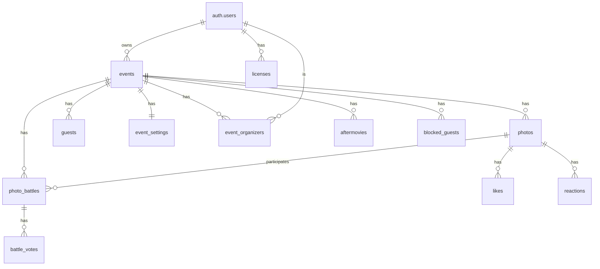

# 🗄️ Schéma de Base de Données - Partywall

Ce document décrit le schéma complet de la base de données Supabase (PostgreSQL) utilisée par Partywall.

---

## 📐 Vue d'ensemble

Partywall utilise une architecture **multi-tenant SaaS** avec la table `events` comme point central. Toutes les données sont isolées par événement via la colonne `event_id`.

### Architecture Multi-Tenant

```
events (table centrale)
  ├── photos (1-N)
  ├── guests (1-N)
  ├── event_settings (1-1)
  ├── event_organizers (1-N)
  ├── photo_battles (1-N)
  ├── battle_votes (1-N)
  ├── aftermovies (1-N)
  └── blocked_guests (1-N)
```

### Diagramme des Relations



---

## 📊 Tables Principales

### 1. `events` - Événements (Table Centrale)

Table centrale du système multi-tenant. Chaque événement représente un événement distinct (mariage, anniversaire, etc.).

| Colonne | Type | Description |
|---------|------|-------------|
| `id` | UUID | Identifiant unique (PRIMARY KEY) |
| `slug` | TEXT | Identifiant unique pour l'URL (ex: "mariage-sophie-marc") - UNIQUE |
| `name` | TEXT | Nom de l'événement |
| `description` | TEXT | Description de l'événement (optionnel) |
| `owner_id` | UUID | ID du propriétaire (référence `auth.users.id`) |
| `created_at` | TIMESTAMPTZ | Date de création |
| `updated_at` | TIMESTAMPTZ | Date de dernière mise à jour |
| `is_active` | BOOLEAN | Indique si l'événement est actif (défaut: true) |

**Index** :
- `idx_events_slug` sur `slug` (UNIQUE)
- `idx_events_owner_id` sur `owner_id`
- `idx_events_is_active` sur `is_active`

**Politiques RLS** :
- **Lecture** : Tous peuvent lire les événements actifs (`is_active = true`)
- **Insertion** : Utilisateurs authentifiés peuvent créer des événements (doivent être owner)
- **Mise à jour** : Owners et organisateurs peuvent modifier
- **Suppression** : Seuls les owners peuvent supprimer

---

### 2. `photos` - Photos et Vidéos

Stocke toutes les photos et vidéos partagées par les invités.

| Colonne | Type | Description |
|---------|------|-------------|
| `id` | UUID | Identifiant unique (PRIMARY KEY) |
| `event_id` | UUID | ID de l'événement (référence `events.id`) |
| `url` | TEXT | URL de la photo (Supabase Storage ou base64) |
| `caption` | TEXT | Légende générée par IA ou saisie manuellement |
| `author` | TEXT | Nom de l'auteur de la photo |
| `created_at` | TIMESTAMPTZ | Date de création |
| `type` | TEXT | Type de média : `'photo'` ou `'video'` (défaut: 'photo') |
| `duration` | NUMERIC | Durée en secondes (pour les vidéos uniquement) |
| `likes_count` | INTEGER | Compteur de likes (mis à jour automatiquement) |
| `tags` | JSONB | Tags suggérés par l'IA (tableau JSON, ex: `["sourire", "groupe"]`) |
| `user_description` | TEXT | Description saisie par l'utilisateur lors de l'upload |

**Contraintes** :
- `type` doit être `'photo'` ou `'video'`
- `event_id` est obligatoire (après migration)

**Index** :
- `idx_photos_created_at` sur `created_at DESC`
- `idx_photos_type` sur `type`
- `idx_photos_author` sur `author`
- `idx_photos_event_id` sur `event_id`
- `idx_photos_tags_gin` sur `tags` (index GIN pour recherches JSONB)

**Politiques RLS** :
- **Lecture** : Tous peuvent lire les photos des événements actifs
- **Insertion** : Tous peuvent uploader des photos (avec `event_id` valide)
- **Suppression** : Seuls les organisateurs peuvent supprimer

---

### 3. `likes` - Likes sur Photos

Stocke les likes des utilisateurs sur les photos.

| Colonne | Type | Description |
|---------|------|-------------|
| `id` | UUID | Identifiant unique (PRIMARY KEY) |
| `photo_id` | UUID | ID de la photo (référence `photos.id`) |
| `user_identifier` | TEXT | Identifiant de l'utilisateur (nom ou ID) |
| `created_at` | TIMESTAMPTZ | Date de création |

**Contraintes** :
- `UNIQUE(photo_id, user_identifier)` : Un utilisateur ne peut liker qu'une fois une photo

**Index** :
- `idx_likes_photo_id` sur `photo_id`
- `idx_likes_user_identifier` sur `user_identifier`
- `idx_likes_photo_user` sur `(photo_id, user_identifier)`

**Politiques RLS** :
- **Lecture** : Tous peuvent lire les likes
- **Insertion** : Tous peuvent ajouter un like
- **Suppression** : Tous peuvent retirer leur like

**Triggers** :
- `likes_count_trigger` : Met à jour automatiquement `photos.likes_count` lors d'insertion/suppression

---

### 4. `reactions` - Réactions Émojis

Stocke les réactions émojis (6 types : heart, laugh, cry, fire, wow, thumbsup).

| Colonne | Type | Description |
|---------|------|-------------|
| `id` | UUID | Identifiant unique (PRIMARY KEY) |
| `photo_id` | UUID | ID de la photo (référence `photos.id`) |
| `user_identifier` | TEXT | Identifiant de l'utilisateur |
| `reaction_type` | TEXT | Type de réaction : `'heart'`, `'laugh'`, `'cry'`, `'fire'`, `'wow'`, `'thumbsup'` |
| `created_at` | TIMESTAMPTZ | Date de création |
| `updated_at` | TIMESTAMPTZ | Date de dernière mise à jour |

**Contraintes** :
- `UNIQUE(photo_id, user_identifier)` : Un utilisateur ne peut avoir qu'une réaction par photo

**Index** :
- `idx_reactions_photo_id` sur `photo_id`
- `idx_reactions_user_identifier` sur `user_identifier`
- `idx_reactions_photo_user` sur `(photo_id, user_identifier)`

**Politiques RLS** :
- **Lecture** : Tous peuvent lire les réactions
- **Insertion** : Tous peuvent ajouter une réaction
- **Mise à jour** : Tous peuvent modifier leur réaction
- **Suppression** : Tous peuvent supprimer leur réaction

**Triggers** :
- `reactions_updated_at_trigger` : Met à jour automatiquement `updated_at` lors de modification

**Fonctions** :
- `get_photo_reactions(photo_uuid UUID)` : Retourne les compteurs de réactions par type en JSONB

---

### 5. `guests` - Invités

Stocke les invités inscrits pour chaque événement.

| Colonne | Type | Description |
|---------|------|-------------|
| `id` | UUID | Identifiant unique (PRIMARY KEY) |
| `event_id` | UUID | ID de l'événement (référence `events.id`) |
| `name` | TEXT | Nom de l'invité |
| `avatar_url` | TEXT | URL de l'avatar (Supabase Storage) |
| `created_at` | TIMESTAMPTZ | Date de création |
| `updated_at` | TIMESTAMPTZ | Date de dernière mise à jour |

**Index** :
- `idx_guests_name` sur `name`
- `idx_guests_created_at` sur `created_at`
- `idx_guests_event_id` sur `event_id`

**Politiques RLS** :
- **Lecture** : Tous peuvent lire les invités des événements actifs
- **Insertion** : Tous peuvent créer un invité (avec `event_id` valide)
- **Mise à jour** : Utilisateurs authentifiés peuvent modifier
- **Suppression** : Utilisateurs authentifiés peuvent supprimer

---

### 6. `blocked_guests` - Invités Bloqués

Stocke les invités temporairement bloqués.

| Colonne | Type | Description |
|---------|------|-------------|
| `id` | UUID | Identifiant unique (PRIMARY KEY) |
| `event_id` | UUID | ID de l'événement (référence `events.id`) |
| `name` | TEXT | Nom de l'invité bloqué |
| `blocked_at` | TIMESTAMPTZ | Date de blocage |
| `expires_at` | TIMESTAMPTZ | Date d'expiration du blocage |
| `created_at` | TIMESTAMPTZ | Date de création |

**Index** :
- `idx_blocked_guests_name` sur `name`
- `idx_blocked_guests_expires_at` sur `expires_at`
- `idx_blocked_guests_event_id` sur `event_id`

**Politiques RLS** :
- **Lecture** : Tous peuvent lire les invités bloqués des événements actifs
- **Insertion** : Seuls les organisateurs peuvent bloquer
- **Suppression** : Seuls les organisateurs peuvent débloquer

**Fonctions** :
- `cleanup_expired_blocks()` : Nettoie automatiquement les blocages expirés

---

### 7. `event_settings` - Paramètres d'Événement

Configuration spécifique à chaque événement (1-1 avec `events`).

| Colonne | Type | Description |
|---------|------|-------------|
| `id` | BIGINT | Identifiant unique (PRIMARY KEY, auto-increment) |
| `event_id` | UUID | ID de l'événement (référence `events.id`, UNIQUE) |
| `event_title` | TEXT | Titre de l'événement (défaut: 'Party Wall') |
| `event_subtitle` | TEXT | Sous-titre (défaut: 'Live') |
| `scroll_speed` | TEXT | Vitesse de défilement (défaut: 'normal') |
| `slide_transition` | TEXT | Type de transition (défaut: 'fade') |
| `decorative_frame_enabled` | BOOLEAN | Active les cadres décoratifs (défaut: false) |
| `decorative_frame_url` | TEXT | URL du cadre décoratif |
| `caption_generation_enabled` | BOOLEAN | Active la génération de légendes IA (défaut: true) |
| `content_moderation_enabled` | BOOLEAN | Active la modération IA (défaut: true, toujours actif) |
| `video_capture_enabled` | BOOLEAN | Active la capture vidéo (défaut: true) |
| `collage_mode_enabled` | BOOLEAN | Active le mode collage (défaut: true) |
| `stats_enabled` | BOOLEAN | Active les statistiques (défaut: true) |
| `find_me_enabled` | BOOLEAN | Active la recherche faciale (défaut: true) |
| `ar_scene_enabled` | BOOLEAN | Active les scènes AR (défaut: true) |
| `battle_mode_enabled` | BOOLEAN | Active le mode battle (défaut: true) |
| `auto_battles_enabled` | BOOLEAN | Active les battles automatiques (défaut: false) |
| `tags_generation_enabled` | BOOLEAN | Active la génération de tags IA (défaut: true) |
| `event_context` | TEXT | Contexte pour personnaliser les légendes IA |
| `alert_text` | TEXT | Texte d'alerte affiché sur le mur |
| `background_desktop_url` | TEXT | URL du fond d'écran desktop |
| `background_mobile_url` | TEXT | URL du fond d'écran mobile |
| `logo_url` | TEXT | URL du logo |
| `logo_watermark_enabled` | BOOLEAN | Active le watermark logo (défaut: false) |
| `caption_language` | TEXT | Langue des légendes (défaut: 'fr') |
| `created_at` | TIMESTAMPTZ | Date de création |
| `updated_at` | TIMESTAMPTZ | Date de dernière mise à jour |

**Contraintes** :
- `UNIQUE(event_id)` : Un seul paramètre par événement

**Index** :
- `idx_event_settings_event_id` sur `event_id` (UNIQUE)

**Politiques RLS** :
- **Lecture** : Tous peuvent lire les paramètres des événements actifs
- **Insertion** : Seuls les organisateurs peuvent créer
- **Mise à jour** : Seuls les organisateurs peuvent modifier

**Realtime** : Activé pour synchronisation automatique des changements

---

### 8. `event_organizers` - Organisateurs d'Événement

Gère les rôles des organisateurs pour chaque événement.

| Colonne | Type | Description |
|---------|------|-------------|
| `id` | UUID | Identifiant unique (PRIMARY KEY) |
| `event_id` | UUID | ID de l'événement (référence `events.id`) |
| `user_id` | UUID | ID de l'utilisateur (référence `auth.users.id`) |
| `role` | TEXT | Rôle : `'owner'`, `'organizer'`, ou `'viewer'` (défaut: 'organizer') |
| `created_at` | TIMESTAMPTZ | Date de création |

**Contraintes** :
- `UNIQUE(event_id, user_id)` : Un utilisateur ne peut avoir qu'un rôle par événement
- `role` doit être `'owner'`, `'organizer'`, ou `'viewer'`

**Index** :
- `idx_event_organizers_event_id` sur `event_id`
- `idx_event_organizers_user_id` sur `user_id`
- `idx_event_organizers_role` sur `role`

**Politiques RLS** :
- **Lecture** : Owners et organisateurs peuvent lire
- **Insertion** : Seuls les owners peuvent ajouter
- **Mise à jour** : Seuls les owners peuvent modifier
- **Suppression** : Seuls les owners peuvent supprimer

**Fonctions** :
- `is_event_organizer(event_uuid UUID, user_uuid UUID)` : Vérifie si un utilisateur est organisateur

---

### 9. `photo_battles` - Battles Photos

Stocke les duels entre deux photos.

| Colonne | Type | Description |
|---------|------|-------------|
| `id` | UUID | Identifiant unique (PRIMARY KEY) |
| `event_id` | UUID | ID de l'événement (référence `events.id`) |
| `photo1_id` | UUID | ID de la première photo (référence `photos.id`) |
| `photo2_id` | UUID | ID de la deuxième photo (référence `photos.id`) |
| `status` | TEXT | Statut : `'active'`, `'finished'`, ou `'cancelled'` (défaut: 'active') |
| `winner_id` | UUID | ID de la photo gagnante (référence `photos.id`, NULL si égalité) |
| `votes1_count` | INTEGER | Nombre de votes pour photo1 (défaut: 0) |
| `votes2_count` | INTEGER | Nombre de votes pour photo2 (défaut: 0) |
| `created_at` | TIMESTAMPTZ | Date de création |
| `finished_at` | TIMESTAMPTZ | Date de fin (NULL si active) |
| `expires_at` | TIMESTAMPTZ | Date d'expiration (NULL si pas d'expiration) |

**Contraintes** :
- `photo1_id != photo2_id` : Les deux photos doivent être différentes
- `status` doit être `'active'`, `'finished'`, ou `'cancelled'`

**Index** :
- `idx_battles_status` sur `status`
- `idx_battles_created_at` sur `created_at DESC`
- `idx_battles_expires_at` sur `expires_at` (WHERE expires_at IS NOT NULL)
- `idx_photo_battles_event_id` sur `event_id`

**Politiques RLS** :
- **Lecture** : Tous peuvent lire les battles des événements actifs
- **Insertion** : Tous peuvent créer une battle (avec `event_id` valide)
- **Mise à jour** : Tous peuvent mettre à jour

**Fonctions** :
- `finish_battle_if_expired()` : Termine automatiquement les battles expirées

---

### 10. `battle_votes` - Votes sur Battles

Stocke les votes des utilisateurs sur les battles.

| Colonne | Type | Description |
|---------|------|-------------|
| `id` | UUID | Identifiant unique (PRIMARY KEY) |
| `battle_id` | UUID | ID de la battle (référence `photo_battles.id`) |
| `user_identifier` | TEXT | Identifiant de l'utilisateur |
| `voted_for_photo_id` | UUID | ID de la photo pour laquelle l'utilisateur a voté |
| `created_at` | TIMESTAMPTZ | Date de création |

**Contraintes** :
- `UNIQUE(battle_id, user_identifier)` : Un utilisateur ne peut voter qu'une fois par battle

**Index** :
- `idx_battle_votes_battle_id` sur `battle_id`
- `idx_battle_votes_user_identifier` sur `user_identifier`
- `idx_battle_votes_battle_user` sur `(battle_id, user_identifier)`

**Politiques RLS** :
- **Lecture** : Tous peuvent lire les votes
- **Insertion** : Tous peuvent voter

**Triggers** :
- `battle_votes_count_trigger` : Met à jour automatiquement `votes1_count` ou `votes2_count` dans `photo_battles`

---

### 11. `aftermovies` - Aftermovies Générés

Stocke les aftermovies (timelapse) générés pour chaque événement.

| Colonne | Type | Description |
|---------|------|-------------|
| `id` | UUID | Identifiant unique (PRIMARY KEY) |
| `event_id` | UUID | ID de l'événement (référence `events.id`) |
| `url` | TEXT | URL publique dans Supabase Storage |
| `storage_path` | TEXT | Chemin dans le bucket Storage |
| `title` | TEXT | Titre de l'aftermovie (optionnel) |
| `filename` | TEXT | Nom du fichier |
| `file_size` | BIGINT | Taille du fichier en octets |
| `duration_seconds` | NUMERIC | Durée de la vidéo en secondes |
| `created_at` | TIMESTAMPTZ | Date de création |
| `created_by` | TEXT | Nom de l'organisateur/admin qui a créé l'aftermovie |
| `download_count` | INTEGER | Nombre de téléchargements (défaut: 0) |

**Index** :
- `idx_aftermovies_event_id` sur `event_id`
- `idx_aftermovies_created_at` sur `created_at DESC`

**Politiques RLS** :
- **Lecture** : Tous peuvent lire les aftermovies des événements actifs
- **Insertion** : Utilisateurs authentifiés peuvent créer
- **Mise à jour** : Utilisateurs authentifiés peuvent modifier
- **Suppression** : Utilisateurs authentifiés peuvent supprimer

**Fonctions** :
- `increment_aftermovie_download_count(aftermovie_id UUID)` : Incrémente le compteur de téléchargements

---

### 12. `licenses` - Licences d'Utilisation

Gère les licences d'utilisation de l'application SaaS.

| Colonne | Type | Description |
|---------|------|-------------|
| `id` | UUID | Identifiant unique (PRIMARY KEY) |
| `user_id` | UUID | ID de l'utilisateur (référence `auth.users.id`) |
| `license_key` | TEXT | Clé unique de la licence (UNIQUE) |
| `status` | TEXT | Statut : `'active'`, `'expired'`, `'suspended'`, ou `'cancelled'` (défaut: 'active') |
| `expires_at` | TIMESTAMPTZ | Date d'expiration |
| `created_at` | TIMESTAMPTZ | Date de création |
| `updated_at` | TIMESTAMPTZ | Date de dernière mise à jour |
| `activated_at` | TIMESTAMPTZ | Date d'activation (NULL si non activée) |
| `last_check_at` | TIMESTAMPTZ | Dernière vérification de la licence |
| `notes` | TEXT | Notes additionnelles |

**Contraintes** :
- `license_key` est UNIQUE
- `status` doit être `'active'`, `'expired'`, `'suspended'`, ou `'cancelled'`

**Index** :
- `idx_licenses_user_id` sur `user_id`
- `idx_licenses_license_key` sur `license_key` (UNIQUE)
- `idx_licenses_status` sur `status`
- `idx_licenses_expires_at` sur `expires_at`
- `idx_licenses_user_status` sur `(user_id, status)`

**Politiques RLS** :
- **Lecture** : Utilisateurs peuvent lire leur propre licence
- **Insertion** : Utilisateurs peuvent créer leur propre licence
- **Mise à jour** : Utilisateurs peuvent mettre à jour leur propre licence

**Triggers** :
- `trigger_update_licenses_updated_at` : Met à jour automatiquement `updated_at`

**Fonctions** :
- `check_license_validity(user_uuid UUID)` : Vérifie la validité d'une licence
- `update_expired_licenses()` : Met à jour le statut des licences expirées
- `get_users_list()` : Récupère la liste des utilisateurs (admin)

---

## 🗂️ Storage Buckets

Supabase Storage est utilisé pour stocker les fichiers (photos, vidéos, cadres, avatars, aftermovies).

### Buckets

| Bucket | Usage | Politique Lecture | Politique Upload |
|--------|-------|-------------------|------------------|
| `party-photos` | Photos invités + Aftermovies | Public (anon + authenticated) | Public (photos), Authenticated (aftermovies) |
| `party-frames` | Cadres décoratifs | Public | Authenticated uniquement |
| `party-avatars` | Avatars invités | Public | Public |
| `party-backgrounds` | Images de fond + Logos | Public | Authenticated uniquement |

### Politiques Storage

**party-photos** :
- **Lecture** : Tous peuvent lire
- **Upload** : Tous peuvent uploader des photos
- **Suppression** : Authenticated uniquement

**party-frames** :
- **Lecture** : Tous peuvent lire
- **Upload/Update/Delete** : Authenticated uniquement

**party-avatars** :
- **Lecture** : Tous peuvent lire
- **Upload/Update** : Tous peuvent uploader/modifier
- **Delete** : Authenticated uniquement

---

## 🔄 Triggers et Fonctions SQL

### Triggers

1. **`likes_count_trigger`** (sur `likes`)
   - Met à jour automatiquement `photos.likes_count` lors d'insertion/suppression de likes

2. **`reactions_updated_at_trigger`** (sur `reactions`)
   - Met à jour automatiquement `updated_at` lors de modification

3. **`battle_votes_count_trigger`** (sur `battle_votes`)
   - Met à jour automatiquement `votes1_count` ou `votes2_count` dans `photo_battles`

4. **`trigger_update_licenses_updated_at`** (sur `licenses`)
   - Met à jour automatiquement `updated_at` lors de modification

### Fonctions

1. **`get_photo_reactions(photo_uuid UUID)`**
   - Retourne les compteurs de réactions par type en JSONB

2. **`update_photo_likes_count()`**
   - Fonction utilisée par le trigger `likes_count_trigger`

3. **`update_battle_votes_count()`**
   - Fonction utilisée par le trigger `battle_votes_count_trigger`

4. **`finish_battle_if_expired()`**
   - Termine automatiquement les battles expirées

5. **`cleanup_expired_blocks()`**
   - Nettoie automatiquement les blocages expirés

6. **`is_event_organizer(event_uuid UUID, user_uuid UUID)`**
   - Vérifie si un utilisateur est organisateur d'un événement (utilisé par RLS)

7. **`check_license_validity(user_uuid UUID)`**
   - Vérifie la validité d'une licence et retourne les informations

8. **`update_expired_licenses()`**
   - Met à jour le statut des licences expirées

9. **`increment_aftermovie_download_count(aftermovie_id UUID)`**
   - Incrémente le compteur de téléchargements d'un aftermovie

10. **`get_users_list()`**
    - Récupère la liste des utilisateurs avec leurs emails (admin)

---

## 🔒 Row Level Security (RLS)

Toutes les tables ont **RLS activé** avec des politiques granulaires basées sur :
- **Rôle** : `anon` (anonyme) ou `authenticated` (authentifié)
- **Propriété** : Ownership (owner d'un événement)
- **Organisation** : Appartenance à un événement (organisateur)
- **État** : Événement actif (`is_active = true`)

### Principes RLS

1. **Isolation par événement** : Toutes les requêtes filtrent par `event_id`
2. **Lecture publique** : Les invités peuvent lire les données des événements actifs
3. **Insertion publique** : Les invités peuvent créer des photos, likes, réactions
4. **Modification authentifiée** : Seuls les organisateurs peuvent modifier/supprimer

### Exemple de Politique RLS

```sql
-- Lecture publique des photos d'un événement actif
CREATE POLICY "Public Read Photos By Event"
ON public.photos FOR SELECT
TO anon, authenticated
USING (
    event_id IS NOT NULL AND
    EXISTS (
        SELECT 1 FROM public.events 
        WHERE events.id = photos.event_id 
        AND events.is_active = true
    )
);
```

---

## 📈 Index et Optimisations

### Index Principaux

- **Par événement** : Toutes les tables ont un index sur `event_id` pour les requêtes multi-tenant
- **Par date** : Index sur `created_at DESC` pour tri chronologique
- **Par utilisateur** : Index sur `user_identifier` pour les requêtes utilisateur
- **Composites** : Index composites pour requêtes fréquentes (ex: `(photo_id, user_identifier)`)
- **JSONB** : Index GIN sur `tags` pour recherches dans les tableaux JSON

### Optimisations

- **Pagination** : Utilisation de `LIMIT` et `OFFSET` pour grandes listes
- **Compteurs** : Compteurs pré-calculés (`likes_count`, `votes1_count`, etc.) pour éviter les COUNT()
- **Cascade** : `ON DELETE CASCADE` pour nettoyage automatique des données liées

---

## 🔄 Realtime (WebSockets)

Les tables suivantes sont publiées dans Supabase Realtime pour synchronisation automatique :

- ✅ `photos` - Nouvelles photos, suppressions
- ✅ `likes` - Ajout/suppression de likes
- ✅ `reactions` - Ajout/modification/suppression de réactions
- ✅ `event_settings` - Changements de paramètres
- ✅ `guests` - Nouveaux invités
- ✅ `photo_battles` - Création, votes, résultats
- ✅ `battle_votes` - Nouveaux votes
- ✅ `aftermovies` - Nouveaux aftermovies générés
- ✅ `events` - Changements d'événements
- ✅ `event_organizers` - Changements d'organisateurs

---

## 📝 Notes de Migration

### Migration Multi-Tenant

L'application a été migrée d'une architecture mono-événement vers une architecture multi-tenant :

1. **Ajout de `event_id`** : Toutes les tables ont reçu une colonne `event_id`
2. **Création d'événement par défaut** : Un événement par défaut a été créé pour les données existantes
3. **Mise à jour des politiques RLS** : Toutes les politiques filtrent maintenant par `event_id`
4. **Fonction helper** : `is_event_organizer()` pour éviter la récursion dans RLS

### Colonnes Ajoutées Progressivement

- `tags` (JSONB) : Tags IA pour les photos
- `user_description` (TEXT) : Description utilisateur pour les photos
- `download_count` (INTEGER) : Compteur de téléchargements pour aftermovies
- `tags_generation_enabled` (BOOLEAN) : Setting pour génération de tags
- `caption_language` (TEXT) : Langue des légendes
- `background_desktop_url`, `background_mobile_url`, `logo_url` : URLs de personnalisation

---

## 🔍 Requêtes Utiles

### Récupérer les photos d'un événement avec leurs réactions

```sql
SELECT 
    p.*,
    get_photo_reactions(p.id) as reactions
FROM photos p
WHERE p.event_id = 'event-uuid'
ORDER BY p.created_at DESC;
```

### Vérifier la validité d'une licence

```sql
SELECT * FROM check_license_validity('user-uuid');
```

### Récupérer les battles actives d'un événement

```sql
SELECT * FROM photo_battles
WHERE event_id = 'event-uuid'
  AND status = 'active'
  AND (expires_at IS NULL OR expires_at > now())
ORDER BY created_at DESC;
```

---

## 📚 Ressources

- **Documentation Supabase** : https://supabase.com/docs
- **PostgreSQL Documentation** : https://www.postgresql.org/docs/
- **Row Level Security** : https://supabase.com/docs/guides/auth/row-level-security

---

**Dernière mise à jour** : 2026-01-15

